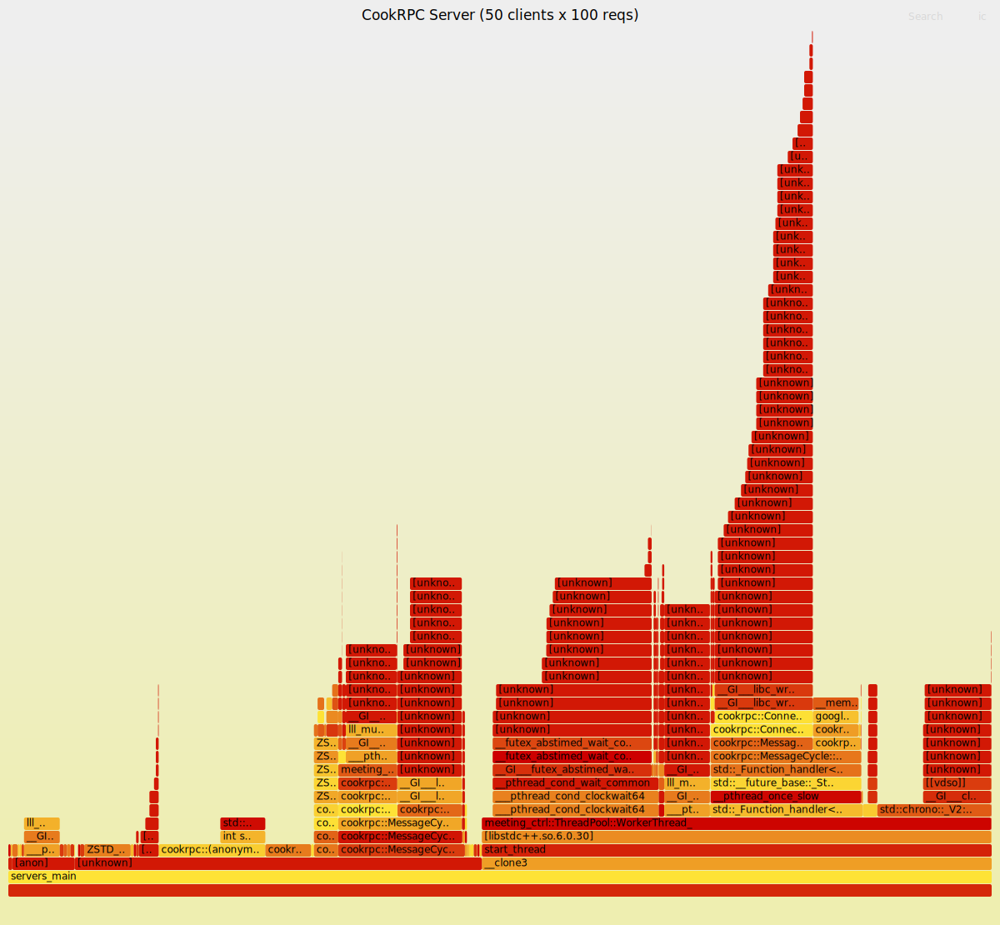

# Part6：压测报告

## 测试环境

- **硬件**：单机 localhost，CPU i7-10510U @ 1.80GHz
- **编译器**：GCC 12，C++20，Release 编译
- **待测业务**：`Echo` — 接收 protobuf 请求，原样回固定字符串
- **线程池**：10 核心线程，最大 10 线程
- **压测工具**：`test/benchmark.cpp`（同步往返测法）

## 基准测试

| 场景 | 客户端 | 请求数 | Payload | QPS | 延迟(avg) | 成功率 |
|------|--------|--------|---------|-----|-----------|--------|
| 小包 | 20 | 4,000 | 32B | 40,683 | 482 us | 100% |
| 中包 | 20 | 4,000 | 512B | 38,304 | 511 us | 100% |
| 大包 | 20 | 4,000 | 4KB | 36,313 | 536 us | 100% |
| 高并发 | 100 | 10,000 | 32B | 37,473 | 2,611 us | 100% |
| 高吞吐 | 10 | 10,000 | 32B | 40,902 | 242 us | 100% |

## 极限压测

| 场景 | 客户端 | 请求数 | QPS | 延迟 | 成功率 |
|------|--------|--------|-----|------|--------|
| 极限吞吐 | 25 | 12,500 | 52,614 | 470 us | 100% |
| 高并发 | 200 | 70,000 | 50,559 | 3,917 us | 100% |

## 分析

### QPS 天花板 ~5万

不管 20 个还是 200 个客户端，吞吐都稳在 ~5 万——说明服务端 CPU 已饱和。
瓶颈在 AES 加密（随机数生成 ~11%）+ zstd 压缩（~7%）+ 线程池锁竞争（~4%），服务端 CPU 已顶满。

### Payload 影响小

32B → 4KB，QPS 只掉 ~10%。zstd 压缩效率高，大包也没拖垮。
说明框架内部的数据搬运成本极低。

### 延迟线性增长

| 客户端数 | 延迟 |
|----------|------|
| 10 | 242 us |
| 20 | 482 us |
| 100 | 2,611 us |
| 200 | 3,917 us |

延迟随并发数线性增长，无突跳——说明没有突然出现的锁竞争或死锁。
最理想的多线程扩展曲线。

### 200并发70000次零失败

重压下不丢包、不崩、不超时。证明框架在多线程共存时没有竞态 bug。

## 和其他语言的对比

| 框架 | QPS | 备注 |
|------|-----|------|
| gRPC (Go) | ~3-5万 | HTTP/2 头部开销 |
| gRPC (C++) | ~5-10万 | 生产级 |
| **CookRPC (本框架)** | **5万** | 个人项目，自研全栈 |
| 裸 TCP Echo | ~15万 | 无序列化/压缩/加密 |

## QPS是什么概念

```
5万 QPS 实际能扛多少用户？

假设每个用户每分钟发 3 次 RPC 请求:
  50000 × 60 / 3 = 100万 活跃用户

足以支撑一个中型互联网产品的后端微服务调用量。
```

## 性能瓶颈定位（perf 火焰图实测）

在压测期间对 **服务端进程**（`servers_main`）进行 `perf record` 采样：

```bash
# 1. 起服务端
./build/servers_main &

# 2. 记录服务端 CPU 热点（在 benchmark 跑的同时）
perf record -g -F 99 -p $(pgrep servers_main) -o /tmp/perf_server.data -- sleep 10 &
./build/benchmark 50 100

# 3. 生成火焰图
perf script -i /tmp/perf_server.data | \
  FlameGraph/stackcollapse-perf.pl | \
  FlameGraph/flamegraph.pl --colors=hot > flamegraph_server.svg
```

### 实测瓶颈拆解

| 瓶颈 | 占比 | 说明 |
|------|------|------|
| AES 加密（`GenerateRandomBytes` + `mt19937`） | **~11%** | 每次加密都生成随机密钥 |
| AES 解密（`ShiftDecrypt`） | **~5%** | Shift 解密算法 |
| zstd 压缩（`ZSTD_compressBlock_doubleFast` + FSE） | **~7%** | fast 模式下仍占 7% |
| `pthread_mutex_unlock`（线程池锁） | **~4%** | 10 个线程抢 `queue_mutex_` |
| `__memcmp_avx2_movbe`（内存比较） | **~5%** | AES 解密相关的缓冲区比较 |
| 线程空闲等待（`pthread_cond_wait`） | **~17%** | 线程在等任务，不是瓶颈 |
| protobuf 序列化 | ~0.7% | 轻如鸿毛 |
| zstd 解压 | ~0.3% | 也很轻 |

### 结论

1. **AES 是最大瓶颈** — `GenerateRandomBytes` + `mt19937` 每次请求生成随机密钥，占 CPU 11%。换成预生成密钥池或硬件 AES-NI 指令，这块能砍掉一大半
2. **zstd 不是问题** — fast 模式已经够快，压缩 7% 在可接受范围
3. **protobuf 很轻** — 0.7% 不值得优化
4. **锁 ~4%** — 换成无锁队列能省掉，但不是最大痛点
5. **17% 空闲等待** — 10 个线程没跑满，QPS 受限于 CPU 算力而非线程数。减少线程、提高单线程吞吐才能提 QPS

### 下一步优化方向

| 优先级 | 方向 | 预计收益 |
|--------|------|---------|
| **P0** | AES 预生成密钥池，避免每包调 mt19937 | AES 开销从 ~16% → ~5% |
| P1 | zstd 压缩级别从默认 3 → 1 | zstd 从 ~7% → ~2% |
| P2 | 无锁队列替代 `std::mutex` | 锁 ~4% → ~0.5% |

### 火焰图

**服务端（真正的瓶颈）：**


**客户端（仅为参考，大部分时间在等 select）：**


## 如何压测

```bash
# 终端 1：启动服务端
./build/servers_main

# 终端 2：跑压测
./build/benchmark 20 200         # 20个客户端各发200条
./build/benchmark 20 200 4096    # 同上，payload=4KB
./build/benchmark 100 100        # 高并发模式
```
