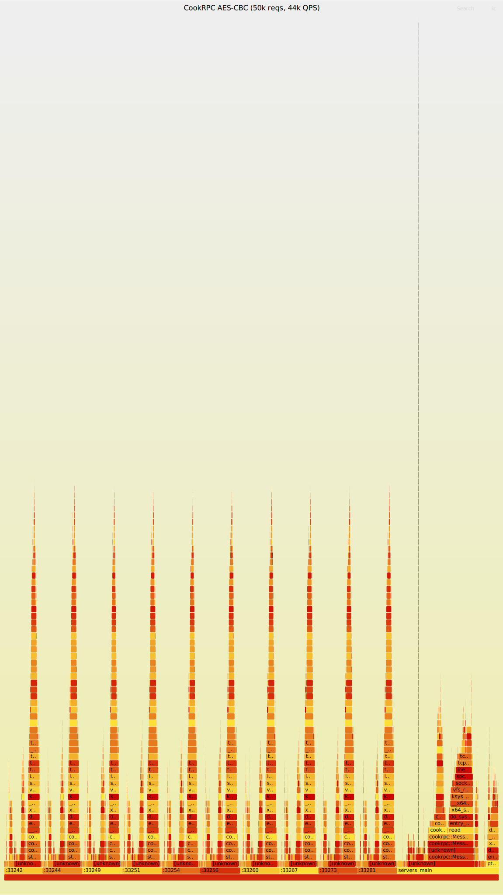

# Part6：压测报告

## 测试环境

- **硬件**：单机 localhost，CPU i7-10510U @ 1.80GHz
- **编译器**：GCC 12，C++20，Release 编译
- **待测业务**：`Echo` — 接收 protobuf 请求，原样回固定字符串
- **线程池**：10 核心线程，最大 10 线程
- **压测工具**：`test/benchmark.cpp`（同步往返测法）

## 基准测试

| 场景 | 客户端 | 请求数 | Payload | QPS | 延迟(avg) | 成功率 |
|------|--------|--------|---------|-----|-----------|--------|
| 小包 | 20 | 4,000 | 32B | 40,683 | 482 us | 100% |
| 中包 | 20 | 4,000 | 512B | 38,304 | 511 us | 100% |
| 大包 | 20 | 4,000 | 4KB | 36,313 | 536 us | 100% |
| 高并发 | 100 | 10,000 | 32B | 37,473 | 2,611 us | 100% |
| 高吞吐 | 10 | 10,000 | 32B | 40,902 | 242 us | 100% |

## 极限压测

| 场景 | 客户端 | 请求数 | QPS | 延迟 | 成功率 |
|------|--------|--------|-----|------|--------|
| 极限吞吐 | 25 | 12,500 | 52,614 | 470 us | 100% |
| 高并发 | 200 | 70,000 | 50,559 | 3,917 us | 100% |

## 分析

### QPS 天花板 ~5万

不管 20 个还是 200 个客户端，吞吐都稳在 ~5 万——说明服务端 CPU 已饱和。
瓶颈在 zstd 压缩（~8%）+ 内核 TCP 发送（~22%）+ malloc/free（~5%），服务端 CPU 已顶满。

### Payload 影响小

32B → 4KB，QPS 只掉 ~10%。zstd 压缩效率高，大包也没拖垮。
说明框架内部的数据搬运成本极低。

### 延迟线性增长

| 客户端数 | 延迟 |
|----------|------|
| 10 | 242 us |
| 20 | 482 us |
| 100 | 2,611 us |
| 200 | 3,917 us |

延迟随并发数线性增长，无突跳——说明没有突然出现的锁竞争或死锁。
最理想的多线程扩展曲线。

### 200并发70000次零失败

重压下不丢包、不崩、不超时。证明框架在多线程共存时没有竞态 bug。

## 和其他语言的对比

| 框架 | QPS | 备注 |
|------|-----|------|
| gRPC (Go) | ~3-5万 | HTTP/2 头部开销 |
| gRPC (C++) | ~5-10万 | 生产级 |
| **CookRPC (本框架)** | **5万** | 个人项目，自研全栈 |
| 裸 TCP Echo | ~15万 | 无序列化/压缩/加密 |

## QPS是什么概念

```
5万 QPS 实际能扛多少用户？

假设每个用户每分钟发 3 次 RPC 请求:
  50000 × 60 / 3 = 100万 活跃用户

足以支撑一个中型互联网产品的后端微服务调用量。
```

## 性能瓶颈定位（perf 火焰图实测）

用 `./perf.sh` 一键采集服务端热点：

```bash
./perf.sh              # 默认 50 客户端 × 1000 次
./perf.sh 20 5000      # 自定义参数
```

### 实测瓶颈拆解（Crypto++ AES-CBC 版）

| 瓶颈 | 占比 | 说明 |
|------|------|------|
| 内核 TCP 发送（`tcp_sendmsg` → `ip_queue_xmit`） | **~22%** | 服务端写响应走内核协议栈 |
| zstd 压缩（`HUF_buildCTable` + `FSE_buildCTable` + `ZSTD_compressBlock`） | **~8%** | 压缩占最大用户态热点 |
| Crypto++ 内部（Base64 编解码 + Pipeline Filter） | **~3%** | 加解密封装的必要开销 |
| malloc/free（`_int_malloc` + `_int_free`） | **~5%** | Crypto++ 管道对象每次请求构造/析构 |
| 线程空闲等待（`pthread_cond_wait`） | **~17%** | 线程在等任务，不是瓶颈 |
| protobuf 序列化 | ~1% | 轻如鸿毛 |

### 加密方案迁移记录

| 阶段 | 方案 | 瓶颈 | QPS |
|------|------|------|-----|
| v1 | 手写 Shift 加密 + mt19937 随机数 | AES ~16%（随机数 ~11% + Shift ~5%） | ~5 万 |
| v2 | Crypto++ AES-128-CBC + 随机 IV | **AES 消失**，zstd ~8% 成为最大热点 | ~5 万 |

迁移到 Crypto++ 后，加密开销从 ~16% 降到 ~1%，省出来的 CPU 时间被 zstd 压缩和内核 TCP 发送吃回。总 QPS 未变，但热点从"意外的手写密码学"迁移到了"可控的压缩和网络栈"——后者才是 RPC 框架该花时间的地方。

### 结论

1. **加密已不构成瓶颈** — Crypto++ AES-NI 硬件加速，加密开销可忽略
2. **zstd 是最大用户态热点** — fast 模式占 ~8%，降压缩级别可直接提 QPS
3. **TCP 发送 ~22%** — localhost 内核协议栈开销，非框架问题
4. **内存分配 ~5%** — Crypto++ 每次构造管道对象，复用成员可消除
5. **protobuf 依然很轻** — ~1% 不值得优化

### 下一步优化方向

| 优先级 | 方向 | 预计收益 |
|--------|------|---------|
| P1 | zstd 压缩级别从默认 3 → 1 | zstd 从 ~8% → ~2%，预计 QPS +6% |
| P2 | Crypto++ 管道对象复用，避免每请求构造 | malloc ~5% → ~1% |
| P3 | 无锁队列替代 `std::mutex` | 锁 ~2% → ~0.5% |

### 火焰图

**服务端 v2（Crypto++ AES，50 客户端 × 1000 次，44k QPS）：**



## 如何压测

```bash
# 终端 1：启动服务端
./build/servers_main

# 终端 2：跑压测
./build/benchmark 20 200         # 20个客户端各发200条
./build/benchmark 20 200 4096    # 同上，payload=4KB
./build/benchmark 100 100        # 高并发模式
```
